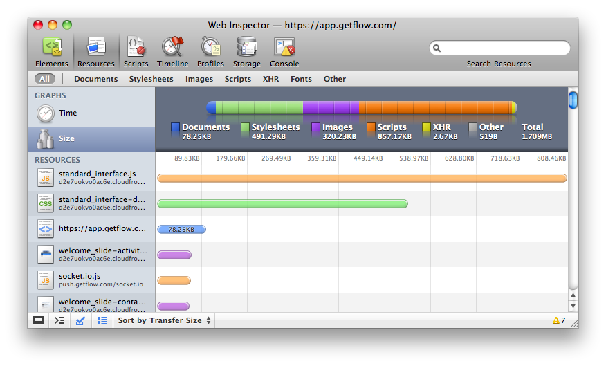

Thomas Fuchs recently [wrote about the advantages of using JavaScript micro-frameworks](http://mir.aculo.us/2011/04/11/i-for-one-welcome-our-new-micro-framework-overlords/):
> I for one welcome our new micro-framework overlords—small frameworks and libraries that do one thing only, not trying to solve each and every problem, just using pure JavaScript to do it. Easy to mix and match, and to customize to your needs.

He also pans "full-stack" frameworks:

> These libraries are HUGE, being 100+ kilobytes in code size, and even minified and gzipped they are pretty big. … A whopping 100% of sites or apps using these libraries don’t use all the features they provide.

His argument sounds good, in theory. The idea that I can pick and choose among a number of well-written and focused JavaScript libraries to assemble the ultimate bespoke JavaScript environment seems very enticing indeed.

The golden rule of software, however, is that unless it is designed to work well together, it usually won't. Mr. Fuchs has apparently never heard of [dependency hell](http://en.wikipedia.org/wiki/Dependency_hell). Dustin Diaz has done a great job of putting together many of these micro-frameworks with [Ender.js](http://dustindiaz.com/ender), but as a curator, [he has to rely on the original author if he wants to make a change](https://twitter.com/ded/status/55867027650379778).

This attitude also continues the trend of giving developers overwhelming choice. Convention-over-configuration and emphasis on developer ergonomics are key to getting real work done. _Of course_ Mr. Fuchs is able to tell you which JavaScript library will precisely match your requirements—_he writes JavaScript libraries in his spare time!_ For the rest of us, we don't really want choice; we just want what's best.

If choice was more important than well-tested integration, the majority of attendees at last week's CodeConf would have been carrying ThinkPads instead of MacBook Pros. Instead, developers want a _happy path_ that they can be reasonably assured will work well. If it doesn't meet their needs, they want the ability to augment or replace the components that make up their integrated system.

Here's the reality: As web applications get more complex, developers end up needing all of the miscellaneous nuts and bolts that they thought they would never use. Take [Flow](https://app.getflow.com/) for example. Flow is a killer task manager web application built on [Backbone.js](http://backbonejs.org/). Backbone.js often advertises that it is only 3.9kb minified and compressed. How much of Flow's nearly 900k of (minified!) JavaScript do you think is the application developers filling in the deficiencies in Backbone?

[SproutCore](http://www.sproutcore.com) is often dismissed because of its size. _Of course_ minimizing size is important. But if it takes a megabyte of JavaScript to ship the features you want, better the bulk of that code live in a framework instead of your application. Living in a framework means that it has been reviewed and optimized by an entire community of developers, and improves without any effort on your part. New Twitter currently clocks in at _over_ a megabyte of JavaScript:

To the best of my knowledge, Twitter is not using any third-party libraries except for Mustache and jQuery. That means that a _huge_ amount of JavaScript was written by Twitter engineers just to provide the framework in which the application runs. This isn't stuff specific to Twitter. This is, for example, code that determines how to propagate changes to the DOM when the data model changes via XHR—a problem that _all_ JavaScript developers face.

SproutCore may be big, but it's because web applications are getting more complex every day, and we all have a common set of complex problems to solve. Oversimplifying the problem is disingenuous and forces each application to fend for itself. Mr. Fuchs says:

> Small code is good code: the fewer lines in your source, the fewer bugs you’ll have, plus it will download and execute faster.

If creating a modern web app requires a megabyte of JavaScript, would you rather write, debug and optimize all of that code yourself?

It's time to lay to rest the argument that full-stack libraries are unable or unfit to solve real problems. Instead, they are _best_ suited to tackle the problems faced by modern web app developers. The same criticisms full-stack frameworks receive today are eerily similar to the same criticisms levied at jQuery several years ago. Unless you are planning to discontinue your application in six months, it's time to start developing for the future.

_Thanks to Charles Jolley for reviewing this post. <em>I tweet at [@tomdale](http://twitter.com/tomdale) if you want more timely updates._</em>
